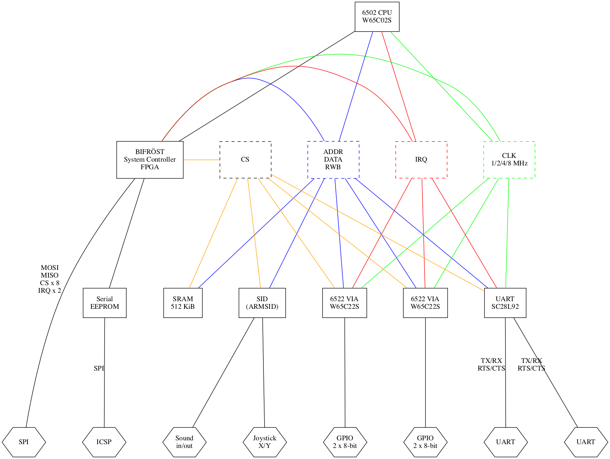

pda6502v2
=========

Version two (complete redesign) of https://github.com/pda/pda6502

A single board computer with 6502 CPU, 64 KiB RAM, GPIO+UART+SPI I/O,
FPGA system controller / address decoder, serial EEPROM boot loader.

Version two aims to address the main pain points of version one:

* tedious software/bootloader development cycle, removing and reprogramming EEPROM.
* limited/slow serial communications (bit-banged via 6522 GPIO).
* no UART for serial console etc.
* inflexible address bus mapping with hard-wired logic gates.

Comparison table
----------------

|                       | v1                  | v2                             |
| --------------------- | ------------------- | ------------------------------ |
| Voltage               | 5.0V                | 3.3V                           |
| Address decode logic  | 7400-series chips   | FPGA                           |
| Schematic/layout tool | EAGLE               | KiCad                          |
| Boot                  | EEPROM              | FPGA loads boostrap from flash |
| Clock                 | 1 MHz osc           | ?                              |
| I/O                   | GPIO                | GPIO, UART, SPI                |

FPGA system controller: BIFRÖST
-------------------------------

An FPGA (Lattice ICE40HX1K-TQ144) acts as a system controller (dubbed BIFRÖST)
with three primary functions;

### System startup

Startup code is stored in an on-board SPI serial EEPROM (e.g. Microchip
AT25M01) which can be written from an external computer via SPI, e.g. using an
off-board FTDI FT232H interface.

BIFRÖST bootstraps the system by copying a fixed size/location bootloader from
serial EEPROM into main RAM before starting CPU.  The bootloader may load
further code/data from the serial EEPROM.

This solves the main pain point of version one, in which program/bootloader
development involved removing and rewriting an EEPROM on every development
iteration.

### Address logic

Mapping of the address space to SRAM and I/O chips is also handled by BIFRÖST.
This provide very low propagation time allowing for fast clock speed, and is
in-circuit programmable for flexible address space / logic design without
hardware changes.

BIFRÖST has the entire address bus, data bus, control signals and clock,
allowing for arbitrary address mapping. For example a control register could be
exposed for state-based mapping, e.g. memory layer switching like the Commodore
64.

### BIFRÖST chip selection / considerations

Any signal that can be routed through / controlled by BIFRÖST should be, so
that design decisions are pushed from hardware schematic and into FPGA HDL
which can be easily altered after assembly.

BIFRÖST needs to perform:

* chip-enable and mode selection (RWB etc) for each chip on the bus,
* control over all IRQ signals,
* RDY and SYNC signals from 6502 CPU for better single-step support etc.
* VPB (vector pull) from 6502 CPU for interrupts.

| Signal   | Pins |
| -------- | ---- |
| ADDR     |  16  |
| CLK      |   1  |
| CPU IRQ  |   1  |
| CPU RDY  |   1  |
| CPU SYNC |   1  |
| CPU VPB  |   1  |
| DATA     |   8  |
| RESET    |   1  |
| RWB      |   1  |
| SPI IRQ  |   4  |
| SPI MISO |   4  |
| SPI MOSI |   1  |
| SPI SCLK |   1  |
| SPI SEL  |   4  |
| SRAM CS  |   2  |
| SRAM RWB |   1  |
| UART CS  |   1  |
| UART IRQ |   1  |
| UART RWB |   1  |
| VIA CS   |   2  |
| VIA IRQ  |   2  |
| VIA RWB  |   2  |

Brings total to 40, at which point a XC2C128A-VQ100 CPLD would be suitable,
with plenty of spare I/O and double the macrocells. The pin count and 0.5mm pin
spacing of VQ100 makes soldering more difficult, but sparser pin utilization
means layout flexibility.  However the BIFRÖST system controller FPGA
(ICE40HX1K-VQ100) has the same pin count, and should be suitable for all this
and more.

I/O
---

- SPI: 4 devices
- GPIO: 2 x 8-bit ports
- UART

### SPI

BIFRÖST maps registers into the 6502 address space, implementing SPI master
similar to http://6502.org/users/andre/spi65b/index.html

This hardware SPI communication is orders of magnitude faster than 6522
bit-banging, making SPI display output more viable.

### GPIO

WDC W65C22S (6522) VIA provides two 8-bit GPIO ports, as well as timers etc.

### UART

NXP SC28L91 3.3V UART PLCC44

Useful information in http://forum.6502.org/viewtopic.php?f=4&t=4587

Power supply
------------

The main system board expects a regulated 3.3 VDC, which may be done by a small
add-on board or module. All internal and external signals are 3.3V. If FPGA
and/or CPLD chips require lower voltages, these will be stepped down from the
3.3V supply.

Block diagram
-------------

