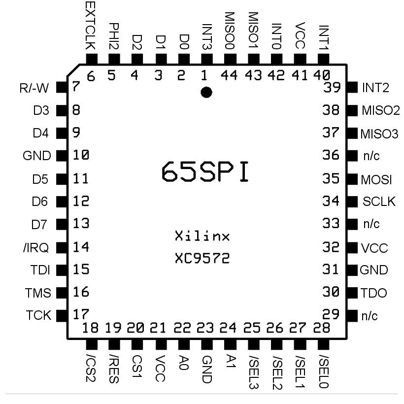

SPI65/B
=======

This directory contains resources relating to
[SPI65/B by André Fachat][spi65b],
which is a VHDL reimplimentation (with modifications) of
[65SPI by Daryl Rictor][65spi].

SPI65/B is designed for a Xilinx XC9572 CPLD (5V, 72 macrocells), so should
work unmodified on a newer XC9572XL (3.3V). It also appears to fit a newer
Xilinx CoolRunner-II XC2C64A-VQ44, although D7 signal moves to make way for
VCCIO1. That change has been made in `SPI65-B.ucf` here, as well as rotating
the pin numbers by 6 to suit VQ44 instead of PC44.

The following information is (C) 2011-2012 André Fachat, but reproduced here
for posterity, and may not reflect changes made in this fork.

[spi65b]: http://6502.org/users/andre/spi65b/index.html
[65spi]: http://sbc.rictor.org/65spi.html

---

The SPI65/B is a reimplemented version of Daryl's 65SPI, but with these modifications:

* The divisor is shortened to 4 bit, so you can divide the clock by between 2
  and 16.
* The chip handles four instead of eight devices
* The MISO is separate for each device (in case that separation is not
  necessary you can put the same signal on all pins)
* There are four high-active interrupt inputs (one for each device), with
  interrupt enable bits each, to forward the interrupts to the host (6502).
  Those interrupts are independent from the SPI interrupt.
* The status of the interrupt bits can also be read from a register
* Select lines initialize to one (deselected), and writes also clear the SPI
  interrupt
* If only the lowest four bits of the divider are used, and only the low four
  devices, it is software-compatible with Daryl's 65SPI

Pinout
------

Pin description

* `PHI2` Microprocessor system clock (input)
* `A0-A1` Microprocessor address bus (input)
* `CS1` Chip select, active high (input)
* `/CS2` Chip select, active low (input)
* `R/-W` Microprocessor data read/write line (input)
* `D0-D7` Microprocessor data bus (bidirectional)
* `/IRQ` Microprocessor interrupt line, active low (output)
* `/RES` Microprocessor reset line, active low (input)
* `EXTCLK` External shift clock (optional input)
* `MISO0-3` SPI Master In, Slave Out line (4 inputs, one for each device)
* `MOSI` SPI Master Out, Slave In line (output)
* `SCLK` SPI Shift Clock output
* `/SEL0-3` Slave Select lines (4 outputs, one for each device)
* `INT0-3` Interrupt input (4 inputs, one for each device)
* `GND` System ground
* `VCC` System +5vdc
* `n/c` No connection

Please note that the CPLD is basically "full". If you need to reassign signals to other pin positions, your mileage may vary. I already had problems placing the signals in a way fitting my netusb2 board.

Register Map
------------

<table>
<tr><th>CS1</th><th>/CS2</th><th>PHI2</th><th>A0</th><th>A1</th><th>Read (R/-W=1)</th><th>Write (R/-W=0)</th></tr>
<tr><td>0  </td><td>x</td>   <td>x</td>   <td>x</td> <td>x</td> <td>Hi-Z</td>         <td>Hi-Z</td></tr>
<tr><td>x</td>  <td>1</td>   <td>x</td>   <td>x</td> <td>x</td> <td>Hi-Z</td>         <td>Hi-Z</td></tr>
<tr><td>x</td>  <td>x</td>   <td>0</td>   <td>x</td> <td>x</td> <td>Hi-Z</td>         <td>Hi-Z</td></tr>
<tr><td>1</td>  <td>0</td>   <td>1</td>   <td>0</td> <td>0</td> <td>SPI Data In</td>  <td>SPI Data Out</td></tr>
<tr><td>1</td>  <td>0</td>   <td>1</td>   <td>0</td> <td>1</td> <td>SPI Status Register</td>  <td>SPI Control Register</td></tr>
<tr><td>1</td>  <td>0</td>   <td>1</td>   <td>1</td> <td>0</td> <td>Bit 0-3: SCLK Divisor Bit 4-7: INT0-3 status</td><td>Bit 0-3: SCLK Divisor Bit 4-7: n/a</td></tr>
<tr><td>1</td>  <td>0</td>   <td>1</td>   <td>1</td> <td>1</td> <td>Bit 0-3: Slave Select 0-3 Bit 4-7: IEN0-3 interrupt enable</td><td>Bit 0-3: Slave Select 0-3 Bit 4-7: IEN0-3 interrupt enable</td></tr>
</table>
